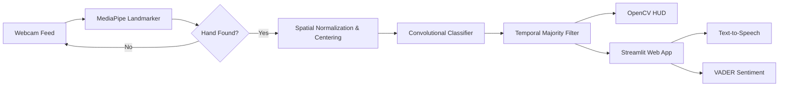

# E-Braille: Multilingual Sign Language Recognition

*Real-time sign language interpretation and assistive communication using MediaPipe and convolutional neural networks.*

 

[Overview](#overview) • [System Pipeline](#system-pipeline) • [Key Features](#key-features) • [Demonstrations](#demonstrations) • [Technical Specifications](#technical-specifications) • [Supported Languages](#supported-languages) • [Authors](#authors)

 

> [!NOTE]
> This repository documents the architecture, interface design, and experimental results for our final year capstone project. The model weights and training pipeline are kept in a private repository for academic requirements. For live demonstrations or questions about the paper, please reach out via LinkedIn.

---

## Overview

E-Braille translates hand signs into text and spoken audio in real time using a standard consumer webcam. The system processes video at over 30 FPS and classifies gestures across five regional sign languages: American Sign Language (ASL), British Sign Language (BSL), Bangladesh Sign Language (BDSL), Bahasa Isyarat Malaysia (BIM), and Japanese Sign Language (JSL).

Raw video crops often fail when a user shifts distance from the camera or moves quickly between gestures. To keep predictions stable, E-Braille uses an aspect-preserving coordinate normalization step that centers hands on a fixed canvas, followed by a temporal majority-voting filter to eliminate prediction flicker. In addition to a live OpenCV head-up display, the project includes a Streamlit web platform with browser text-to-speech, basic sentence sentiment analysis, and interactive learning games.

---

## System Pipeline

  

### How the Pipeline Works

1. **Landmark Detection**: MediaPipe Hands extracts 21 3D landmarks for each detected hand, providing coordinates regardless of lighting or background changes.
2. **Aspect-Preserving Normalization**: Instead of stretching the bounding box directly into a square, the system calculates the hand's aspect ratio ($h / w$). It scales the crop along its longer side and centers it onto a clean $300 \times 300$ white canvas. This keeps finger proportions intact whether the user is close to or far from the webcam.
3. **Neural Network Inference**: The centered crop is resized to $224 \times 224$, normalized to $[-1, 1]$, and passed through a convolutional neural network (CNN) trained on curated gesture sets.
4. **Temporal Majority Voting**: A rolling buffer tracks predictions across the last five frames ($N = 5$). The system only displays a new gesture when at least 50% of the buffer agrees and confidence exceeds 0.35. This prevents the output from rapidly jumping between classes during hand transitions.
5. **Output and Interfaces**: The filtered prediction is sent to either the low-latency OpenCV display for direct signing or to the Streamlit app for speech synthesis, quizzes, and dictionary lookups.

---

## Key Features

- **Five Sign Languages**: Recognizes alphabets, numbers, and common everyday signs across ASL, BSL, BDSL, BIM, and JSL.
- **Consistent Scaling**: Aspect-preserving centering keeps inputs uniform regardless of how far the user stands from the camera.
- **Stable Live Predictions**: Rolling-buffer majority voting eliminates frame-to-frame flicker while signing.
- **Educational Web Portal**: A Streamlit interface with a searchable sign library, interactive quizzes, and browser-based audio playback.
- **Sentence and Sentiment Building**: Signs can be committed into complete sentences with basic emotional tone analysis (Positive, Neutral, Negative) via VADER.
- **Gesture Games**: Includes a real-time Rock-Paper-Scissors game against the computer and interactive practice challenges.

---

## Demonstrations

### Live Camera Overlay
The OpenCV interface tracks hand position, displays classification confidence, and allows users to append confirmed signs to a running sentence buffer.

  
  
<em>Real-time ASL alphabet recognition with live confidence readout.</em>

   
  
  
<em>Common phrase recognition paired with VADER sentence sentiment tracking.</em>

### Streamlit Learning Platform
The web interface gives students and educators a structured dictionary, practice flashcards, and automated text-to-speech feedback.

  
  
<em>Accessible learning dashboard with gesture reference cards and audio output.</em>

### Gesture-Controlled Games
Users can practice hand shapes interactively by playing Rock-Paper-Scissors against the system in real time.

  
  
<em>Real-time gesture interaction running at sub-35 ms latency.</em>

---

## Technical Specifications

| Parameter | Configuration |
| :--- | :--- |
| **Landmark Extractor** | MediaPipe Hands (21 3D coordinates) |
| **Camera Feed** | 1080p capture cropped and centered onto a $300 \times 300$ canvas |
| **Model Input** | $224 \times 224 \times 3$, normalized to $[-1, 1]$ |
| **Inference Latency** | $25\text{--}35\text{ ms}$ per frame (~30 FPS on CPU) |
| **Smoothing Window** | 5 frames, minimum 50% consensus, 0.35 confidence threshold |
| **Speech Engine** | Browser Web Speech API |
| **Sentiment Analysis** | VADER Lexicon |
| **Interface Layers** | OpenCV (real-time HUD) and Streamlit (web platform) |

---

## Supported Languages

| Language | Code | Dataset Scope |
| :--- | :--- | :--- |
| **American Sign Language** | ASL | Alphabets (A–Z), Numbers (0–9), Common Phrases |
| **British Sign Language** | BSL | Numbers (0–9), Common Phrases |
| **Bangladesh Sign Language** | BDSL | Numbers (0–9), Common Phrases |
| **Bahasa Isyarat Malaysia** | BIM | Common Phrases |
| **Japanese Sign Language** | JSL | Syllabary Characters |

  
  
<em>Class sample distributions across regional gesture collections.</em>

---

## Authors

Developed by **Phuah Hong Xuan** and **Pua Hoong Ze** as a Final Year Capstone Project at Sunway University / Sunway College, Malaysia.

  

> [!TIP]
> If you are interested in trying a live demo, reading our complete final report, or discussing the methodology, please connect with us on [LinkedIn](https://www.linkedin.com).
