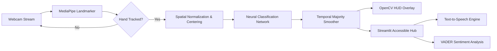
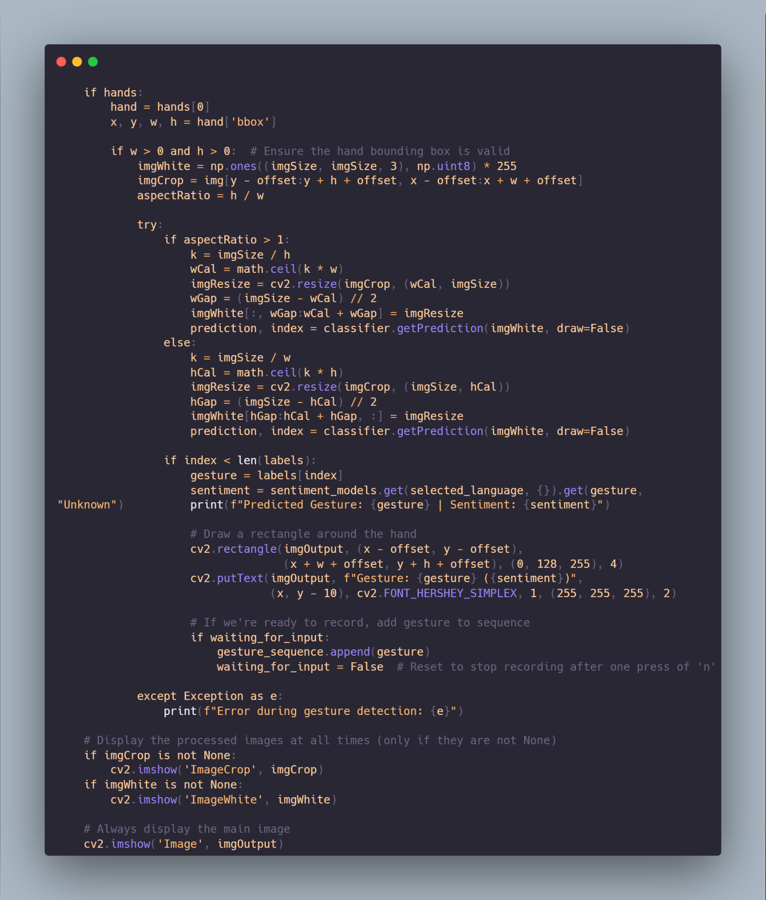
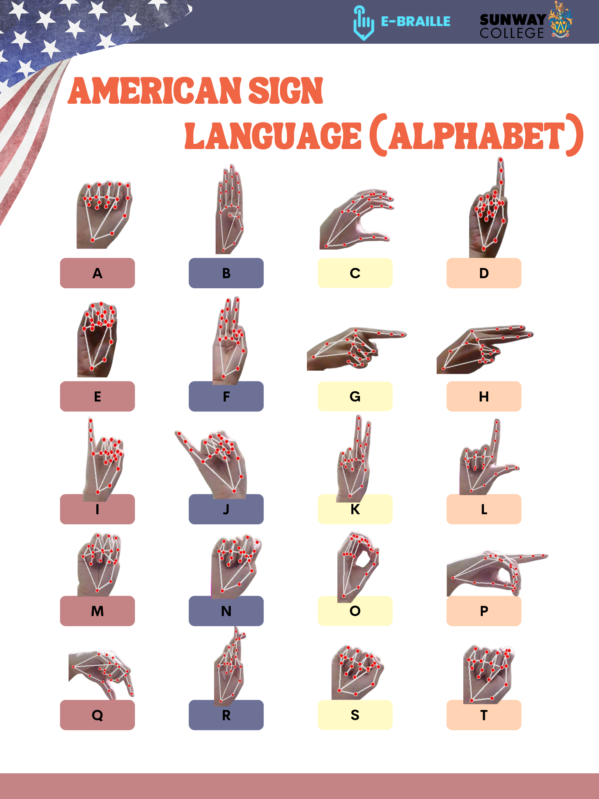
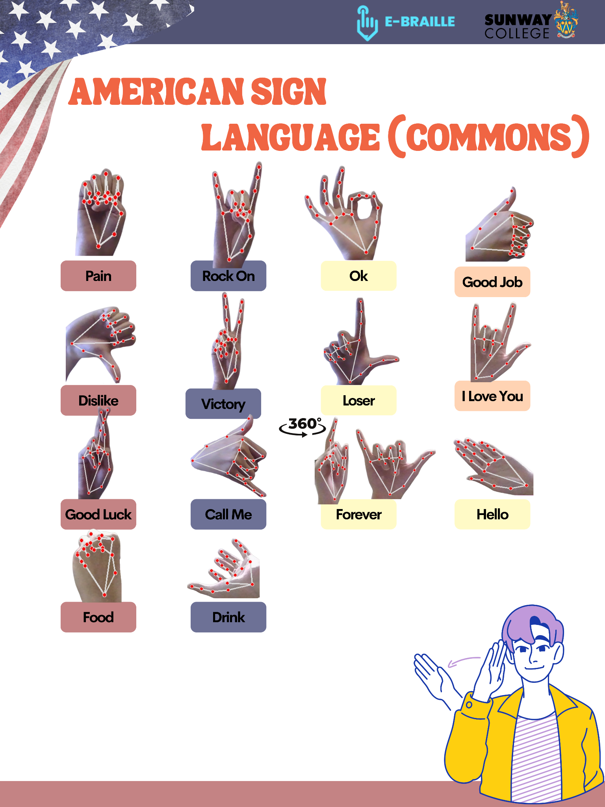
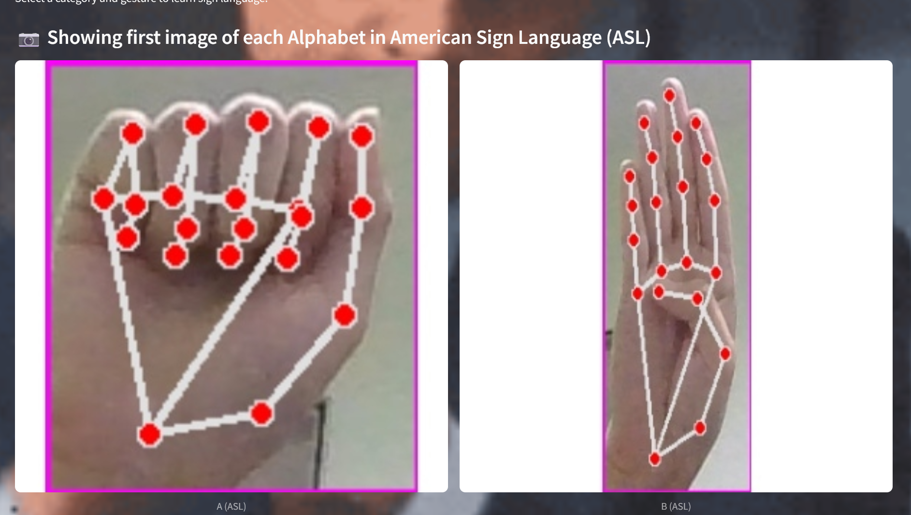
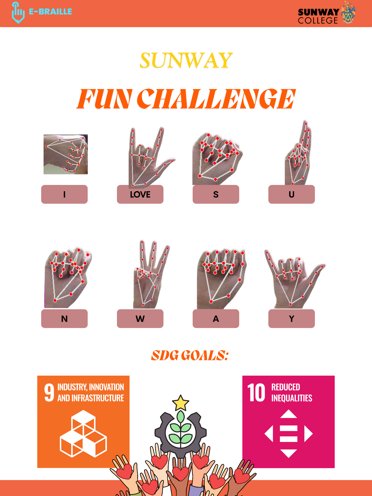
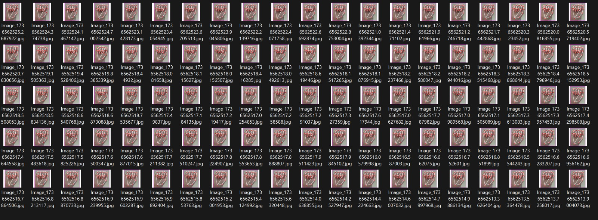
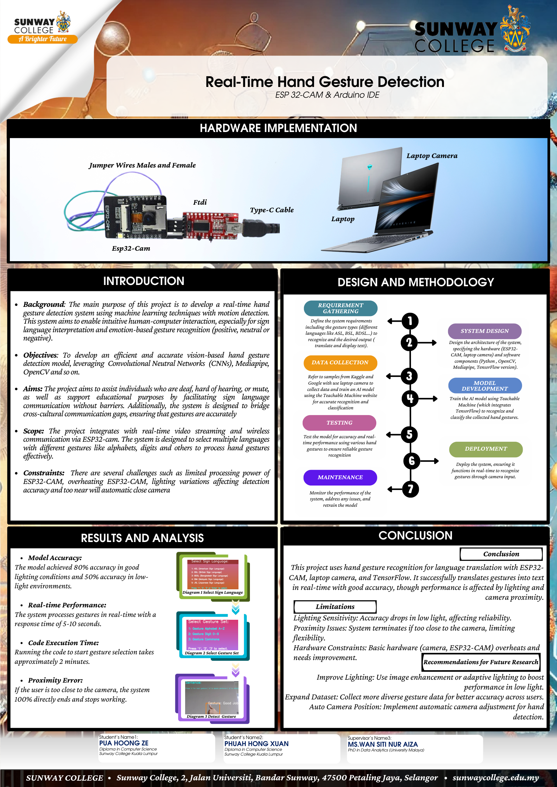

# E-Braille: Multilingual Sign Language Recognition Platform

*Real-time assistive computer vision and deep learning system for sign language translation and interactive learning*

 

[Overview](#overview) • [Architecture](#architecture) • [Features](#features) • [Demonstration](#demonstration) • [Specifications](#specifications) • [Supported Dialects](#supported-dialects) • [Authors](#authors)

 

> [!NOTE]
> **Showcase & Architecture Repository**  
> This repository serves as an open architecture reference, technical specification, and portfolio showcase. The proprietary neural network weights and core inference backend are maintained in a private repository for academic and intellectual property governance. Live demonstrations and full research papers are available upon inquiry.

---

## Overview

Over 70 million deaf individuals globally face persistent communication barriers in healthcare, education, and daily commercial transactions. **E-Braille** is an assistive computer vision system designed to bridge this divide through real-time sign language recognition, automated speech synthesis, and interactive educational tooling on standard consumer webcams.

The system combines Google MediaPipe skeletal tracking, dynamic aspect-preserving spatial normalization, deep convolutional classification, and a temporal majority-voting consensus engine to deliver low-latency (30+ FPS) interpretation across 5 international and regional sign dialects.

---

## Architecture

The end-to-end processing pipeline operates in five decoupled stages:

  

### Processing Stages

1. **Skeletal Landmark Acquisition**: Extracts 21 3D hand coordinates per frame using Google MediaPipe Hands, operating independently of skin tone, background complexity, and variable ambient lighting.
2. **Aspect-Preserving Spatial Normalization**: Computes bounding box dimensions $(w, h)$ and calculates the aspect ratio ($h / w$). The hand crop is scaled along its dominant axis and centered onto a constant $300 \times 300$ white canvas with zero padding, eliminating perspective distortions caused by hand-to-camera distance variations.
3. **Deep Neural Inference**: Feeds normalized $224 \times 224$ tensors scaled to dynamic range $[-1.0, 1.0]$ into a deep convolutional network architecture for category probability estimation.
4. **Temporal Majority Smoothing**: Buffers predictions into a rolling deque of $N=5$ consecutive frames. A gesture is confirmed only when consensus exceeds $50\%$ and mean confidence satisfies the activation threshold ($\ge 0.35$), preventing frame-to-frame flicker during dynamic transitions.
5. **Presentation & Accessible Output**: Routes verified predictions to either the low-latency OpenCV Head-Up Display (HUD) or the full-featured Streamlit accessible browser hub.

---

## Features

- **Multilingual Sign Recognition**: Interprets 5 distinct regional and international sign dialects: ASL, BSL, BDSL, BIM (Malaysian Sign Language), and JSL (Japanese Syllabary).
- **Scale-Invariant Preprocessing**: Mathematical canvas centering guarantees identical input geometry regardless of user distance from the camera lens.
- **Anti-Flicker Consensus Engine**: Sliding-window majority voting suppresses transitional hand noise and false-positive spikes.
- **Accessible Web Platform**: Streamlit-driven user portal offering live recognition, visual dictionaries, quizzes, and browser-based Text-to-Speech (TTS) synthesis.
- **Sentiment & Conversational Parsing**: Ingests recognized gesture sequences into a VADER natural language engine to determine emotional valence (Positive, Neutral, Negative).
- **Interactive Gamification**: Includes a real-time gesture-driven Rock-Paper-Scissors (RPS) game engine and educational challenge modes designed to increase engagement among students and early signers.

---

## Demonstration

### Live Computer Vision HUD
The real-time computer vision interface overlays bounding boxes, predicted gestures, confidence scores, and a running sentence buffer onto the live camera stream.

  
  
<em>Real-time ASL alphabet tracking with dynamic confidence metrics.</em>

   
  
  
<em>Common conversational signs with real-time VADER emotional sentiment scoring.</em>

### Accessible Web Learning Hub
The browser-based educational interface provides reference materials, sign dictionaries, interactive quizzes, and automated audio playback.

  
  
<em>Streamlit platform with multimodal learning resources and vocal synthesis.</em>

### Interactive Gesture Game Engine
A dedicated gesture state machine enables real-time webcam gameplay against an automated computer opponent.

  
  
<em>Rock-Paper-Scissors gesture game loop running at sub-35ms latency.</em>

---

## Specifications

| Specification | Implementation Detail |
| :--- | :--- |
| **Landmark Tracking** | MediaPipe Hands (21 3D landmarks) |
| **Input Resolution** | $1920 \times 1080$ capture, cropped & centered to $300 \times 300$ canvas |
| **Tensor Dimension** | $224 \times 224 \times 3$, normalized to range $[-1.0, 1.0]$ |
| **Inference Latency** | $25 - 35\text{ ms}$ per frame (~30 FPS on standard CPU) |
| **Smoothing Window** | Deque size $N=5$, agreement threshold $\ge 0.50$, confidence threshold $\ge 0.35$ |
| **Audio Engine** | Web Speech API (in-browser client-side synthesis) |
| **Sentiment Engine** | VADER (Valence Aware Dictionary and sEntiment Reasoner) |
| **Application Layer** | OpenCV HUD (low latency) + Streamlit (multimodal web) |

---

## Supported Dialects

The platform spans both static character alphabets and multi-gesture conversational phrases across five regional standards:

| Dialect | Standard Code | Supported Categories |
| :--- | :--- | :--- |
| **American Sign Language** | ASL | Alphabet (A–Z), Digits (0–9), Common Everyday Phrases |
| **British Sign Language** | BSL | Digits (0–9), Common Everyday Phrases |
| **Bangladesh Sign Language** | BDSL | Digits (0–9), Common Everyday Phrases |
| **Bahasa Isyarat Malaysia** | BIM | Common Conversational Signs |
| **Japanese Sign Language** | JSL | Japanese Syllabary Characters |

  
  
<em>Sample class distribution across regional datasets.</em>

---

## Authors

This project was developed as a Final Year Capstone Research Project at **Sunway University / Sunway College**, Malaysia:

- **Phuah Hong Xuan**
- **Pua Hoong Ze**

  

> [!TIP]
> For academic inquiries, collaboration opportunities, or live system demonstrations, please reach out via [LinkedIn](https://www.linkedin.com).
